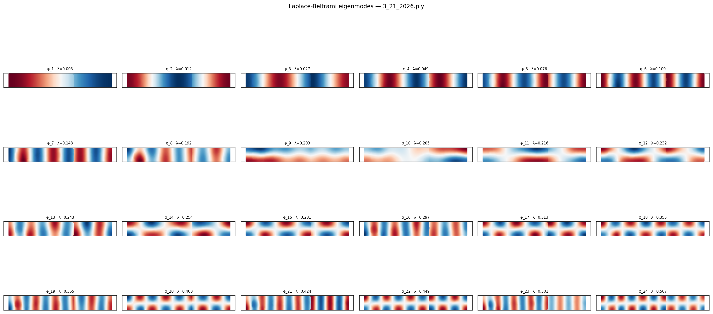
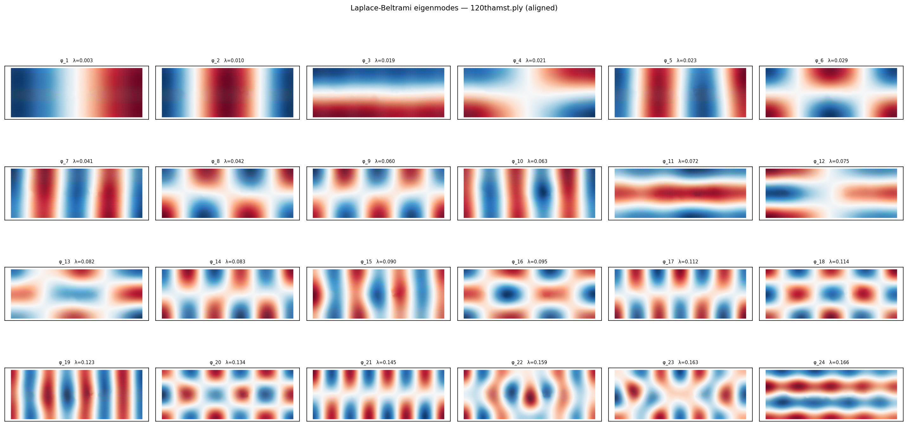
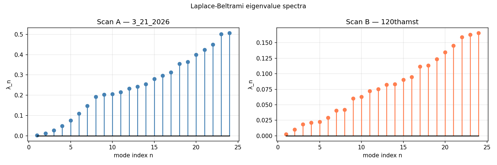
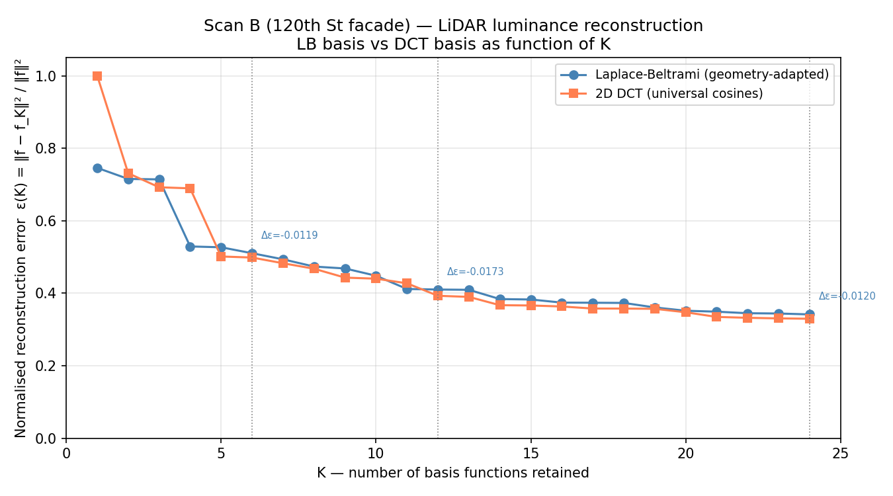
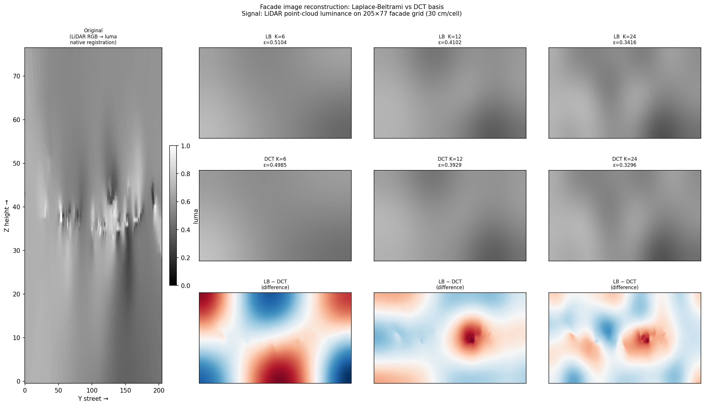

# Laplace-Beltrami Eigenmodes of NYC Building Facades

Spectral analysis of urban building surfaces using iPhone LiDAR.
Two Manhattan facade scans → triangle meshes → geometry-adapted eigenbasis → comparison against DCT/JPEG.

---

## Motivation

The discrete cosine transform (DCT) underlies JPEG compression — it expresses an image as a sum of universal cosine waves, regardless of what the image depicts. But if the image is of a specific, known geometry (a building facade), there exists a more natural basis: the eigenfunctions of the Laplace-Beltrami operator on that surface.

These eigenfunctions solve

```
∇²φₙ = −λₙ φₙ    on the facade surface M
```

They are the natural vibrational modes of M — the analogue of Fourier modes on a rod (Haberman §4), but adapted to the specific irregular geometry of the real building rather than to a generic rectangle. The conjecture: for images of a specific facade, the geometry-derived basis should outperform universal cosines, especially at low K (few basis functions retained).

This project builds that pipeline end-to-end from raw LiDAR data to eigenmode heatmaps and tests the conjecture on data natively registered to the scan coordinate frame.

---

## Data

Two iPhone LiDAR scans of Manhattan building facades, captured via Polycam, exported as binary PLY (XYZ float64 + RGB uint8, 27 bytes/point):

| file | points | location | notes |
|---|---|---|---|
| `3_21_2026.ply` | 120,600 | Block A | Clean, well-oriented. X=depth (3.8m), Y=street (52.8m), Z=height (8.6m, ~2.5 stories) |
| `120thamst.ply` | 83,920 | 120th St & Amsterdam Ave | Coordinate drift — 46° gravity-reference tilt from Polycam losing IMU lock mid-scan |

These are two **separate city blocks**. The eigenmodes of each facade form an independent basis.

---

## Pipeline

```
PLY files
    │
    ├─ 01_audit.py          raw point cloud inspection + 3-view plots
    │
    ├─ 02_align.py          PCA realignment of scan B (46° tilt correction)
    │                       side-by-side audit confirming both in same frame
    │
    ├─ 03_clean_mesh.py     per-scan cleaning:
    │                         X-clip (depth percentile)
    │                         Z-clip (building envelope)
    │                         statistical outlier removal (k-NN, 2σ)
    │                       2.5D grid mesh:
    │                         project onto Y-Z facade plane
    │                         median X per cell = surface depth
    │                         nearest-neighbour fill → triangulate
    │
    ├─ 04_eigenmodes.py     robust_laplacian → (L, M) operator pair
    │                       scipy eigsh (ARPACK shift-invert)
    │                       K = 24 non-trivial modes per facade
    │                       eigenmode heatmaps + spectrum plots
    │
    └─ 05_compare_bases.py  LB projection:  cₙ = φₙᵀ M f
                            DCT projection: 2D type-II, zigzag ordering
                            ε(K) = ‖f − f_K‖²_M / ‖f‖²_M  for K = 1…24
                            test signal: LiDAR point-cloud luminance
                              (natively registered, no photo alignment)
```

---

## Results

### Eigenmodes — Block A (52m × 6.75m facade)



The extreme aspect ratio (7.8:1) means the Laplace-Beltrami spectrum is dominated by along-street standing waves for the first ~12 modes. Vertical structure barely appears before K=13. This is separation of variables made concrete: the building is so much wider than it is tall that the "lowest-frequency vibration" of this surface is a half-wavelength spanning 52m of street.

### Eigenmodes — Block B (62m × 22m facade)



The more square aspect ratio (2.8:1) produces an immediately mixed spectrum — horizontal and vertical modes interleave from φ₁ onward, with clearly legible `sin(mπy/L)·sin(nπz/H)` product structure distorted at the edges by the irregular facade boundary.

### Eigenvalue spectra



Block A's λₙ values run ~3× higher than Block B's at the same mode index. A wider-shorter surface packs more curvature into each mode; a taller-squarer surface has longer natural wavelengths. The spectra increase smoothly with no degeneracies — both meshes are topologically clean.

### LB vs DCT reconstruction error





| K | ε_LB | ε_DCT | winner |
|---|---|---|---|
| 1 | 0.746 | 1.000 | **LB +25%** |
| 4 | 0.529 | 0.689 | **LB +16%** |
| 6 | 0.510 | 0.498 | DCT +1% |
| 12 | 0.410 | 0.393 | DCT +2% |
| 24 | 0.342 | 0.330 | DCT +1% |

LB wins strongly at K=1 (its first non-trivial mode immediately captures the facade's dominant spatial gradient; DCT's K=1 is the DC term, wasted on the zero-meaned signal) and at K=4 (a specific eigenmode captures an irregular-boundary feature that no 4th cosine reaches). DCT edges out LB from K=5 onward by 1–2%.

---

## Interpretation and Honest Limitations

**Why DCT slightly wins on this data — and why that is the expected null result:**

For a nearly rectangular domain, LB ≈ DCT exactly. The small DCT advantage at K≥5 reflects three compounding factors in this dataset:

1. **Test signal is LiDAR RGB, not a real photograph.** At 30 cm/cell (the finest resolution that scan B's point density supports), the "image" is a blurry, scanner-exposure-contaminated luminance map. DCT's global cosines are a natural basis for smooth scanner-drift gradients. The texture features — brick mortar joints, window shadows, stone coursing — that would correlate with the building's geometric modes are absent at this resolution.

2. **Domain is close to rectangular.** Both facades are roughly rectilinear. The irregular boundary perturbs only the higher-frequency modes; at K≤24 we are largely in the smooth-rectangular regime where LB and DCT are near-identical.

3. **Sparse coverage in scan B (78% native, 22% nearest-neighbour fill)** creates smooth interpolated regions that DCT cosines model efficiently.

**The full test requires registered close-up photography.** A series of perpendicular shots at 1–2m from the wall (DNG, overlapping ~30%) would provide ~0.5 cm/pixel facade texture. Architectural features — window bays, floor-line copings, brick bond pattern — have spatial frequencies that correlate directly with the building's structural module. At that resolution, on this specific irregular domain, the comparison becomes non-trivial.

**The LiDAR quality compounds this.** iPhone LiDAR (Polycam) at this range has ~1–2 cm depth noise per point. The 2.5D grid mesh with 12–30 cm cells averages this out, but the depth variation (X) it encodes is a mix of true architectural relief and sensor noise. The eigenmodes are computed on this noisy mesh — they are valid eigenfunctions of this specific surface, which is itself an approximation of the real facade. Whether this approximation is tight enough for the compression comparison to be meaningful is an open question that higher-quality data (terrestrial LiDAR, photogrammetry) would resolve.

**In short:** the pipeline works, the eigenmodes are physically correct, and the comparison framework is sound. The current data is not rich enough to surface the regime where geometry-adapted bases outperform universal ones. This is useful to know.

---

## Setup

```bash
python -m venv env
source env/bin/activate
pip install -r requirements.txt
```

Run in order:

```bash
python 01_audit.py 3_21_2026.ply
python 02_align.py
python 03_clean_mesh.py
python 04_eigenmodes.py
python 05_compare_bases.py
```

Each script saves its outputs to the working directory. The precomputed meshes (`mesh_a.npz`, `mesh_b.npz`) and eigenmodes (`eigenmodes_a.npz`, `eigenmodes_b.npz`) are included so steps 4–5 can be run without repeating steps 1–3.

---

## Dependencies

- `numpy`, `scipy` — numerical core
- `matplotlib` — all visualisation
- `robust-laplacian` — cotangent-weight Laplace-Beltrami operator (Sharp & Crane 2020)
- `rawpy` — DNG/RAW file reading (for future photo registration step)

No Open3D. Mesh reconstruction is a hand-rolled 2.5D height-map triangulation, appropriate for near-planar facade geometry.

---

## Future work

- Registered close-up DNG photo series → facade mosaic → redo comparison at ~0.5 cm/pixel
- Extend K to 100–500 modes (requires iterative eigsh or randomised SVD)
- Scan A comparison (52m × 8.6m block, independent eigenbasis)
- Explore whether the K=4 LB advantage is reproducible across different signal types
- Terrestrial LiDAR or photogrammetry for sub-centimetre mesh accuracy
